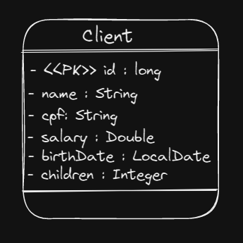

<p align="center">
  
</p>

<h1 align="center">Client registration</h1>

[](#table-of-contents)

<p align="center">
  <a href="#Introduction"> 🧩 Introduction </a>&nbsp;&nbsp;&nbsp;|&nbsp;&nbsp;&nbsp;
  <a href="#Resultados"> 🚀 Resultados</a>&nbsp;&nbsp;&nbsp;|&nbsp;&nbsp;&nbsp;
  <a href="#Dependências"> 🧪 Dependências</a>&nbsp;&nbsp;&nbsp;|&nbsp;&nbsp;&nbsp;
  <a href="#Creditos"> 🏆 Créditos </a>&nbsp;&nbsp;&nbsp;&nbsp;&nbsp;&nbsp;
</p>

<br/>

<a id="Introduction"></a>
## 🧩 Introduction
***⠀Project for client registration demonstrating the basic functions of a CRUD, 
for creation, reading, updating and deletion.***
<br/>

<a id="Resultados"></a>
## 🚀 Results

## Class diagram

<br/>
[](#table-of-contents)
## Result of requests

### Pick up all clients

### ```GET ```
```URL 
    http://localhost:8080/clients
```
#### ```return: JSON```
```
  [
    {
        "id": 1,
        "name": "João Silva",
        "cpf": "123.456.789-09",
        "salary": 5000.0,
        "birthDate": "15-01-1990",
        "children": 2
    },
    {
        "id": 2,
        "name": "Maria Santos",
        "cpf": "529.982.247-25",
        "salary": 7000.0,
        "birthDate": "30-06-1985",
        "children": 1
    },
    {
        "id": 3,
        "name": "Pedro Oliveira",
        "cpf": "012.345.678-90",
        "salary": 4000.0,
        "birthDate": "20-09-1995",
        "children": 0
    }
 ]
```
<br/>

### Returns a client by id
### ```GET ```
```URL
    http://localhost:8080/clients/2
```
#### ```return: JSON```
```
 [
    {
        "id": 2,
        "name": "Maria Santos",
        "cpf": "529.982.247-25",
        "salary": 7000.0,
        "birthDate": "30-06-1985",
        "children": 1
    }
]
```
<br/>

### Returns a customer by name or CPF
### ```GET ```
```URL
    http://localhost:8080/clients/search/Pedro Oliveira
    OR
    http://localhost:8080/clients/search/012.345.678-90
```
#### ```return: JSON```
```
 [
    {
        "id": 3,
        "name": "Pedro Oliveira",
        "cpf": "012.345.678-90",
        "salary": 4000.0,
        "birthDate": "20-09-1995",
        "children": 0
    }
]
```
#### ```SQL Query```
```
     SELECT *
     FROM tb_client
     WHERE name LIKE CONCAT('%', :text, '%')
     OR cpf = :text
     ORDER BY id
```
<br/>

### Create a new cliente
### ```POST ```
```URL
    http://localhost:8080/clients
```
#### ```POST body```
```
 [
    {
        "name": "Ana Silvada",
        "cpf": "987.654.321-00",
        "salary": 4000.0,
        "birthDate": "20-07-1990",
        "children": 0
    }
]
```
#### ```return: JSON```
```
 [
    {
        "id": 4,
        "name": "Ana Silvada",
        "cpf": "987.654.321-00",
        "salary": 4000.0,
        "birthDate": "20-07-1990",
        "children": 0
    }
]
```
<br/>

### Delete a client by id
### ```DELETE ```
```URL
    http://localhost:8080/clients/3
```

### Update a client by id
### ```PUT ```
```URL
    http://localhost:8080/clients/4
```
#### ```PUT body```
```
 [
    {
        "name": "Ana da Silva",
        "cpf": "987.654.321-00",
        "salary": 4000.0,
        "birthDate": "20-07-1998",
        "children": 0
    }
]
```
#### ```return: JSON```
```
 [
    {
        "id": 4,
        "name": "Ana da Silva",
        "cpf": "987.654.321-00",
        "salary": 4000.0,
        "birthDate": "20-07-1998",
        "children": 0
    }
]
```
<br/>

[](#table-of-contents)

<a id="Dependências"></a>
## 🧪 Dependências

## `📖 Dependencies`
```
    <dependencies>
        <dependency>
            <groupId>org.springframework.boot</groupId>
            <artifactId>spring-boot-starter-data-jpa</artifactId>
        </dependency>
        <dependency>
            <groupId>org.springframework.boot</groupId>
            <artifactId>spring-boot-starter-validation</artifactId>
        </dependency>
        <dependency>
            <groupId>org.springframework.boot</groupId>
            <artifactId>spring-boot-starter-web</artifactId>
        </dependency>
        <dependency>
            <groupId>com.h2database</groupId>
            <artifactId>h2</artifactId>
            <scope>runtime</scope>
        </dependency>
        <dependency>
            <groupId>org.springframework.boot</groupId>
            <artifactId>spring-boot-starter-test</artifactId>
            <scope>test</scope>
        </dependency>
        <dependency>
            <groupId>org.hibernate.validator</groupId>
            <artifactId>hibernate-validator</artifactId>
            <version>8.0.0.Final</version>
        </dependency>
    </dependencies>
```

<a id="Creditos"></a>
## 🏆 Créditos
<div > 

| [<br><sub> José Antonio </sub>](https://www.linkedin.com/in/josé-antônio-chaves-junior/) | ***Hello 😃 Se você chegou até aqui, acredito que gostou do meu projeto, nesse caso temos algo em comum, sendo assim que tal conversamos um pouco? Meu chama no linkedin 😁*** | 
|---|---|


</div> 
